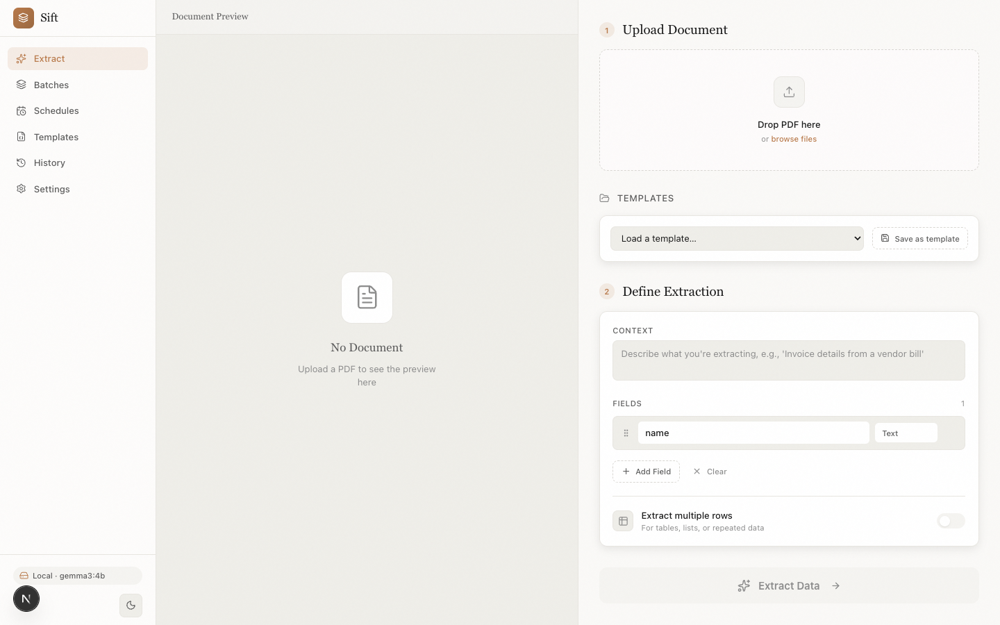
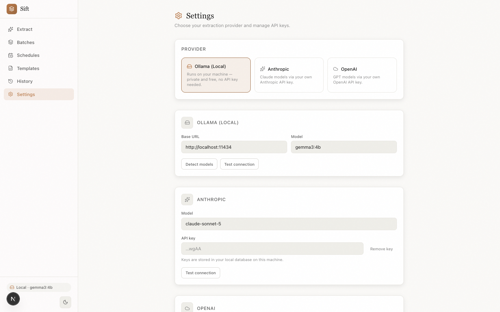
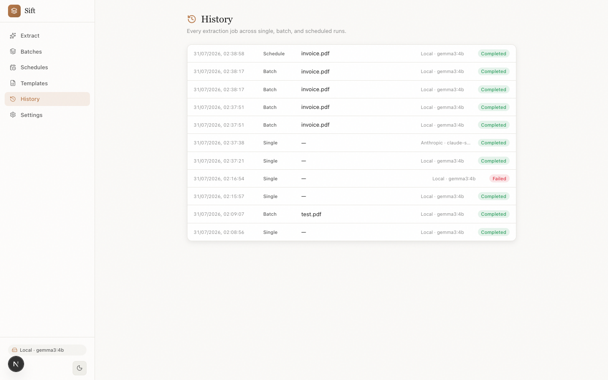
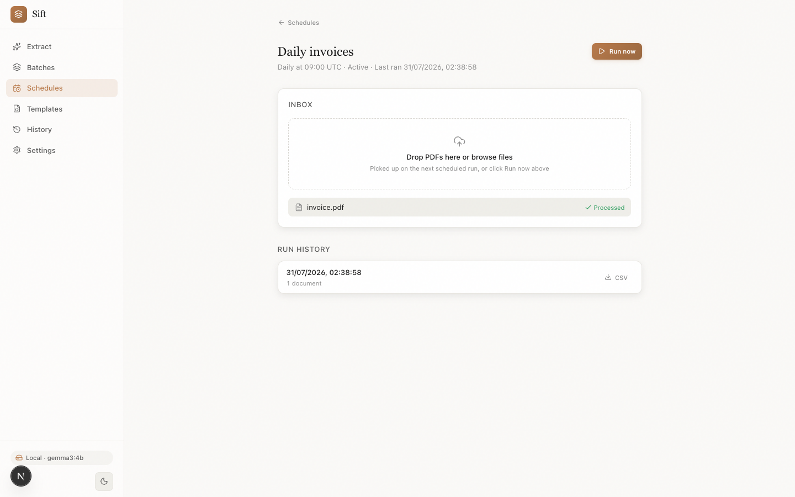

# Sift


Open-source, self-hostable document extractor that runs fully local by default (Ollama) and never marks up your tokens (BYO cloud key).

## Quick start

```bash
git clone https://github.com/mike-whypred/sift && cd sift
npm install
npm run dev
```

Requires Node 20+. SQLite auto-creates at `./data/sift.db` on first run — no separate database setup. The app is at http://localhost:3000. Set `SIFT_DATA_DIR` to point the database and uploaded-file storage at a different directory (defaults to `./data`); `SIFT_MIGRATIONS_DIR` similarly overrides where the Drizzle migration files are read from (defaults to `./drizzle`).

### Localhost only, by default

There is no auth. `npm run dev` / `npm start` bind to `127.0.0.1` only, so the app is reachable from this machine alone. If you want LAN access anyway, run `next dev -H 0.0.0.0` (or `next start -H 0.0.0.0`, or your own interface) — at your own risk, since anyone who can reach that address can read your extraction history, spend your BYO API key, and edit your settings.

## Provider setup

### Ollama (default, local)

1. [Install Ollama](https://ollama.com).
2. `ollama pull gemma3:4b`.
3. If Ollama isn't running on the default `http://localhost:11434`, set the base URL in Settings.

Vision-capable models (gemma3 is one) also read images locally. Text-layer PDFs extract locally with any model; scanned PDFs need a vision path (local vision model for images, or a cloud provider for PDFs).

### Anthropic / OpenAI / Gemini (BYO key)

Add your API key and model in Settings. Keys are stored in your local SQLite database on this machine — plaintext, single-user; treat `./data` as sensitive.

### Any OpenAI-compatible endpoint

Point the OpenAI-compatible provider at a base URL — Groq, vLLM, LM Studio, or Ollama's own `/v1` endpoint all work. API key optional (many local servers don't need one).

## Desktop app

**One-command install (macOS, Apple Silicon):**

```bash
curl -fsSL https://raw.githubusercontent.com/mike-whypred/sift/main/install.sh | sh
```

Downloads the latest release to /Applications and launches it. The build is unsigned for now — the script clears the quarantine flag for you (you're choosing to trust an open-source build you can read right here). Or grab the `.dmg` from [Releases](https://github.com/mike-whypred/sift/releases) and right-click → Open on first launch.

**Or build it yourself:**

```bash
npm run desktop:build
```

Produces an unsigned `Sift.app` (plus `.dmg`/`.zip`) in `dist-desktop/` — a native window around the same app, with your data in `~/Library/Application Support/Sift/`. On first launch macOS Gatekeeper will warn because the build is unsigned: right-click the app → Open. If Ollama isn't running, the app walks you through installing it (or lets you continue with cloud keys). Signed installers and auto-update are on the roadmap.

`npm run desktop:dev` runs the desktop shell against the dev server.

## Privacy

In local (Ollama) mode, documents never leave your machine. With a cloud provider, document content goes to that provider only — there is no third-party server of ours involved.

## Formats

PDF, Word (`.docx`), PowerPoint (`.pptx`), email (`.eml`), images (PNG/JPEG/WEBP, via vision models), and plain text (`.txt`/`.md`/`.csv`).

## Features

- Two-pane workspace: document on the left, fields and results on the right — extracted values are highlighted where they appear in the source text
- Grounded mode (opt-in): every value comes with the exact source quote it was lifted from — highlights anchor precisely, and values the model couldn't ground are flagged for review
- Build fields from a plain-language description: describe the task, and the model scaffolds the field definitions, types, and prompt for you (grounded mode)
- Per-template few-shot examples that guide the extraction model
- Per-field descriptions the model reads as extraction guidance
- Review and edit every value before export; exports use your edits
- Datasets: append matching extraction results into a durable local table and export one merged CSV
- Per-extraction provider/model picker with an always-on 🔒 Local / ☁ Cloud badge
- 9 preset templates (invoices, receipts, bank statements, pay stubs, purchase orders, utility bills, résumés, contracts)
- Batches and recurring schedules with document inboxes and Run now
- History with provider/model recorded per job
- CSV/JSON export
- Provider settings with test-connection

## Comparison

| | Parseur / Parserr / Docparser | **Sift** |
|---|---|---|
| Hosting | Cloud only | Self-host or (later) hosted |
| Data locality | Leaves your infra | **Stays local** with Ollama |
| Pricing | Per-page toll (~3–10¢) | At-cost inference / free self-host |
| Model choice | Vendor-locked | **Any** — Ollama, Anthropic, OpenAI, Gemini, and any OpenAI-compatible endpoint |
| Source | Closed | **Open** |
| Setup for non-tech users | Strong | Parity target for v1 |

## Screenshots

**Workspace** — extract locally, watch values get lifted off the page:



**Settings** — pick a provider, manage keys, test the connection:



**History** — every job with the provider and model that ran it:



**Schedules** — a document inbox processed on a daily or weekly cadence:



## License

[AGPL-3.0-or-later](LICENSE). Free to use, self-host, and modify; if you run a modified sift as a network service, you must offer its source to your users.
